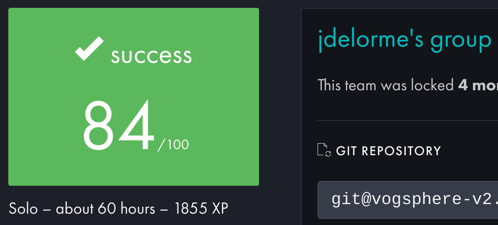

# Push Swap Readme

---


## Swap_push is not so natural

---

## Evaluation:



## Table of Contents

1. What is push_swap?
2. What’s inside?
3. How does it work?
4. How to test?
5. Tester
6. Visualizer
7. About Me
8. License

## What’s about push_swap?

---

Sort a random list of integers using the smallest number of moves, 2 stacks and a limited set of operations.

You start with two empty stacks: **a** and **b**. You are given a random list of integers via command line arguments.

Only these moves are allowed:

- `sa` : swap a - swap the first 2 elements at the top of stack a. Do nothing if there is only one or no elements).
- `sb` : swap b - swap the first 2 elements at the top of stack b. Do nothing if there is only one or no elements).
- `ss` : `sa` and `sb` at the same time.
- `pa` : push a - take the first element at the top of b and put it at the top of a. Do nothing if b is empty.
- `pb` : push b - take the first element at the top of a and put it at the top of b. Do nothing if a is empty.
- `ra` : rotate a - shift up all elements of stack a by 1. The first element becomes the last one.
- `rb` : rotate b - shift up all elements of stack b by 1. The first element becomes the last one.
- `rr` : `ra` and `rb` at the same time.
- `rra` : reverse rotate a - shift down all elements of stack a by 1. The last element becomes the first one.
- `rrb` : reverse rotate b - shift down all elements of stack b by 1. The last element becomes the first one.
- `rrr` : `rra` and `rrb` at the same time.

At the end, **stack b** must empty empty and all integers must be in **stack a**, sorted in ascending order.

## What’s inside?

---

| Makefile | Automates software builds by defining rules and dependencies for make |
| --- | --- |
| Inc | Here is where you can find push_swap.h, where you can see all data structures that are used for the game data. |
| Libft | This is my own C library, with some standard and basic functions. |
| Src | All of my own source code. |

## How does it work?

1. Clone the repo:

```bash
git clone git@github.com:VolmerES/push_swap.git
cd push_swap/
```

1. Compile:

```bash
make
```

1. Run the program, followed by the numbers you want to sort:

```bash
./push_swap 1 8384 123 3454 1231313 3434
```

## Tester:

---

Here you can find a really good tester made by a friend:
https://github.com/PepeSegura/push_swap_Tester

## Visualizer:

---


To visualize code execution and understand the functioning of the two stacks in this repository, follow this repo:

[https://github.com/o-reo/push_swap_visualizer](https://github.com/o-reo/push_swap_visualizer)

---

## 🚀 About Me

---

I’m 42Network student at 42Madrid(Spain)

You I track my progress through the common core at:

[https://profile.intra.42.fr/users/jdelorme](https://profile.intra.42.fr/users/jdelorme)

More about:

[https://img.shields.io/badge/linkedin-0A66C2?style=for-the-badge&logo=linkedin&logoColor=white](https://img.shields.io/badge/linkedin-0A66C2?style=for-the-badge&logo=linkedin&logoColor=white)

## License

---

This project is licensed under the MIT License. See the [LICENSE](https://www.notion.so/LICENSE.md) file for details.
